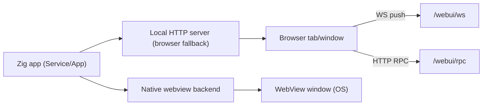

# WebUI Zig

Zig-first WebUI runtime: native webview when available, browser fallback when needed, and a comptime-generated RPC bridge that feels like calling local functions from JS.

- Zig: `0.15.2+` (`build.zig.zon` sets `.minimum_zig_version`)
- CI: Linux/macOS/Windows via `.github/workflows/ci.yml`

## Status (Parity Snapshot)

This repo targets **behavioral parity with upstream `webui.c`**, but it is not yet 100% there.

Current snapshot (`zig build parity-local`):
- `total=40`
- `implemented=36`
- `partial=4`
- `missing=0`

Partial areas (still require manual GUI validation and/or runtime completion):
- `window.visual.transparency`
- `window.visual.frameless`
- `window.visual.corner_radius`
- `server.tls_toggle`

See `parity/status.json`, `docs/manual_gui_checklist.md`, and `docs/upstream_file_parity.md`.

## What You Get

- **Pure Zig active build graph**: no `@cImport`, no `translate-c`, no runtime C/C++/ObjC compilation in the active library.
- **Dev-friendly API**: `App`, `Window`, `Service`, `WindowStyle`, `WindowControl`, typed `Event`s.
- **Comptime RPC surface**: define `pub const rpc_methods = struct { ... }` once, generate JS/TS bridge from it.
- **Push transport for scripts**: WebSocket push channel (no constant `/lifecycle` polling).
- **Aggressive browser discovery**: broad catalog + OS-specific search paths + env overrides.
- **Parity/test gates**: `zig build test`, `zig build examples`, `zig build parity-local`, `zig build os-matrix`.

## Quick Start

```bash
zig build
zig build test
zig build examples
zig build run
```

Run a specific example:

```bash
zig build run -Dexample=fancy_window
```

Force runtime mode for examples:

```bash
zig build run -Dexample=fancy_window -Drun-mode=webview
zig build run -Dexample=fancy_window -Drun-mode=browser
```

List steps and options:

```bash
zig build -l
zig build -h
```

## Add To Your Project

This is a normal Zig package (`.name = "webui"` in `build.zig.zon`).

```bash
zig fetch --save <git-or-tarball-url>
```

```zig
// build.zig
const webui_dep = b.dependency("webui", .{
    .target = target,
    .optimize = optimize,
});
const webui = webui_dep.module("webui");

exe.root_module.addImport("webui", webui);
```

## Transport Model

Browser fallback serves local HTTP and uses a WebSocket push channel for script tasks and lifecycle signaling. Native mode uses the platform webview backend when available.



## Launch Policy (Deterministic)

`AppOptions` now uses a single deterministic policy object:

```zig
pub const LaunchPolicy = struct {
    preferred_transport: enum { native_webview, browser } = .native_webview,
    fallback_transport: enum { none, browser } = .browser,
    browser_open_mode: enum { never, on_browser_transport, always } = .on_browser_transport,
    allow_dual_surface: bool = false,
    app_mode_required: bool = false,
};
```

Decision summary:

| `preferred_transport` | Native backend available | `fallback_transport` | Active transport |
|---|---|---|---|
| `native_webview` | yes | any | `native_webview` |
| `native_webview` | no | `browser` | `browser_fallback` |
| `native_webview` | no | `none` | `native_webview` (error if render required) |
| `browser` | any | any | `browser_fallback` |

Browser opening summary:
- `never`: never auto-launch browser.
- `on_browser_transport`: launch browser only when active transport resolves to browser.
- `always`: always launch browser; combine with `allow_dual_surface=true` for explicit dual-surface behavior.

## API At A Glance

Core flow:
1. Declare `pub const rpc_methods = struct { ... }` (comptime).
2. Initialize `Service` (or `App + Window`).
3. `showHtml/showFile/showUrl` and `run`.

Minimal service:

```zig
const std = @import("std");
const webui = @import("webui");

pub const rpc_methods = struct {
    pub fn ping() []const u8 { return "pong"; }
    pub fn add(a: i64, b: i64) i64 { return a + b; }
};

pub fn main() !void {
    var gpa = std.heap.GeneralPurposeAllocator(.{}){};
    defer _ = gpa.deinit();

    var service = try webui.Service.init(gpa.allocator(), rpc_methods, .{
        .app = .{
            .launch_policy = .{
                .preferred_transport = .native_webview,
                .fallback_transport = .browser,
                .browser_open_mode = .on_browser_transport,
            },
        },
        .window = .{ .title = "WebUI Zig" },
        .rpc = .{ .dispatcher_mode = .threaded },
    });
    defer service.deinit();

    try service.show(.{
        .html =
            "<!doctype html><html><head><meta charset=\"utf-8\"/>" ++
            "<script type=\"module\" src=\"/webui_bridge.js\"></script></head>" ++
            "<body><button id=\"b\">Ping</button><pre id=\"out\"></pre>" ++
            "<script>document.getElementById('b').onclick=async()=>{" ++
            "document.getElementById('out').textContent=" ++
            "`ping=${await webuiRpc.ping()} add=${await webuiRpc.add(20,22)}`;};</script>" ++
            "</body></html>",
    });

    try service.run();
    while (!service.shouldExit()) {
        std.Thread.sleep(10 * std.time.ns_per_ms);
        try service.run();
    }
}
```

## Typed RPC + Bridge Generation

Everything starts with a comptime method set:

```zig
pub const rpc_methods = struct {
    pub fn ping() []const u8 { return "pong"; }
    pub fn add(a: i64, b: i64) i64 { return a + b; }
};
```

What you can generate:
- Runtime-generated JS client string: `Window.rpcClientScript(.{})`
- Comptime JS client string: `webui.Service.generatedClientScriptComptime(rpc_methods, .{})`
- Comptime TypeScript declarations: `webui.Service.generatedTypeScriptDeclarationsComptime(rpc_methods, .{})`

Dispatch modes:
- `sync` (direct execution)
- `threaded` (worker queue)
- `custom` (hook dispatcher)

Async jobs (push-first):
- Set `RpcOptions.execution_mode = .queued_async`.
- `POST <rpc_route>` returns `{ job_id, state, poll_min_ms, poll_max_ms }`.
- Completion is pushed over WebSocket as `rpc_job_update`.
- JS bridge waits for push first, then uses bounded polling fallback (`GET /rpc/job?id=...`).
- Cancel route: `POST /rpc/job/cancel` with `{ "job_id": <id> }`.

Typed APIs:
- `Window.rpcPollJob(allocator, job_id) !RpcJobStatus`
- `Window.rpcCancelJob(job_id) !bool`
- `Service` mirrors both methods.

Runtime introspection and diagnostics:
- `Window.runtimeRenderState()` / `Service.runtimeRenderState()`
- `Window.probeCapabilities()` / `Service.probeCapabilities()`
- `Service.listRuntimeRequirements(allocator)`
- `App.onDiagnostic(...)` / `Service.onDiagnostic(...)`

## Close Semantics (No Random Window Closes)

Close is backend-authoritative:
- The frontend closes **only** after receiving a backend `backend_close` push signal.
- The backend sends the close signal and waits briefly for `close_ack` before tearing down.

This is implemented in `src/root.zig` and `src/bridge/runtime_helpers.source.js`.

## Browser Discovery Catalog

The discovery catalog includes at least these families (and more):
- Firefox, Chrome, Edge, Chromium, Yandex, Brave, Vivaldi
- Epic, Safari, Opera
- Arc, DuckDuckGo, Tor, LibreWolf, Mullvad, Sidekick, Shift, Opera GX, Pale Moon, SigmaOS, Lightpanda

Overrides:
- `WEBUI_BROWSER_PATH` (absolute path)
- `WEBUI_BROWSER` (kind/name)
- `BROWSER` (kind/name)

## Runtime Helper JS Assets

Runtime helpers live in `src/bridge/runtime_helpers.source.js` and are built into two variants:
- `webui.runtime_helpers_js` (embedded; minified by default)
- `webui.runtime_helpers_js_written` (written-file; not minified by default)

Build outputs:
- `zig-out/share/webui/runtime_helpers.embed.js`
- `zig-out/share/webui/runtime_helpers.written.js`

## Linux Runtime Requirements API

You can query runtime packaging requirements before showing a window:

```zig
const reqs = try service.listRuntimeRequirements(allocator);
defer allocator.free(reqs);
for (reqs) |req| {
    std.debug.print("{s}: required={any} available={any}\n", .{
        req.name, req.required, req.available,
    });
}
```

On Linux this reports helper/runtime expectations such as:
- `webui_linux_webview_host`
- `webui_linux_browser_host`

## Build Flags

| Flag | Default | What it does |
|---|---:|---|
| `-Ddynamic=true` | `false` | Builds/installs `webui` as a shared library (`.so`/`.dylib`/`.dll`) instead of a static archive. |
| `-Denable-tls=true` | `false` | Enables TLS defaults in runtime options/API state (transport completion still tracked as partial). |
| `-Denable-webui-log=true` | `false` | Enables runtime logging defaults (prints RPC/control/lifecycle diagnostics). |
| `-Dminify-embedded-js=true` | `true` | Minifies the embedded runtime helper JS asset at build time. |
| `-Dminify-written-js=true` | `false` | Minifies the written runtime helper JS output artifact. |
| `-Dexample=<name>` | `all` | Selects which demo `zig build run` executes. |
| `-Drun-mode=webview|browser` | `webview` | Chooses native-webview vs browser-mode path in examples. |
| `-Dtarget=<triple>` | host | Cross-compiles the library/examples for another target. |

Exported compile-time values:
- `webui.BuildFlags.dynamic`
- `webui.BuildFlags.enable_tls`
- `webui.BuildFlags.enable_webui_log`
- `webui.BuildFlags.run_mode`

## Useful Build Steps

- `zig build` (install)
- `zig build test`
- `zig build dispatcher-stress`
- `zig build examples`
- `zig build run`
- `zig build bridge`
- `zig build runtime-helpers`
- `zig build vfs-gen`
- `zig build parity-report`
- `zig build parity-local`
- `zig build os-matrix`

## Examples

Run all demos:

```bash
zig build run
```

Run one demo:

```bash
zig build run -Dexample=translucent_rounded -Drun-mode=webview
```

Available `-Dexample=` values:
- `minimal`
- `call_js_from_zig`
- `call_zig_from_js`
- `serve_folder`
- `vfs`
- `public_network`
- `multi_client`
- `chatgpt_api`
- `custom_web_server`
- `react`
- `frameless`
- `fancy_window`
- `translucent_rounded`
- `text_editor`
- `minimal_oop`
- `call_js_oop`
- `call_oop_from_js`
- `serve_folder_oop`
- `vfs_oop`
- `all`

## Production Notes

Strong now:
- Typed RPC + generated bridge tooling.
- Browser discovery breadth and fallback control.
- Push messaging for script execution (WebSocket).
- Parity/test gates and static build guards.

Still tracked as partial for strict upstream parity:
- End-to-end HTTPS transport (`server.tls_toggle`).
- Visual parity items require manual GUI smoke on real desktops.

Manual GUI validation checklist: `docs/manual_gui_checklist.md`.

## Layout

- `src/` - active Zig runtime + public API (`src/root.zig`)
- `tools/` - build-time generators (bridge/VFS/assets)
- `docs/` - parity audit + manual validation checklists
- `parity/` - parity status + report definitions
- `upstream_snapshot/` - archived upstream sources (not in active builds)

## Docs

- `docs/migration.md`
- `CHANGELOG.md`
- `docs/upstream_file_parity.md`
